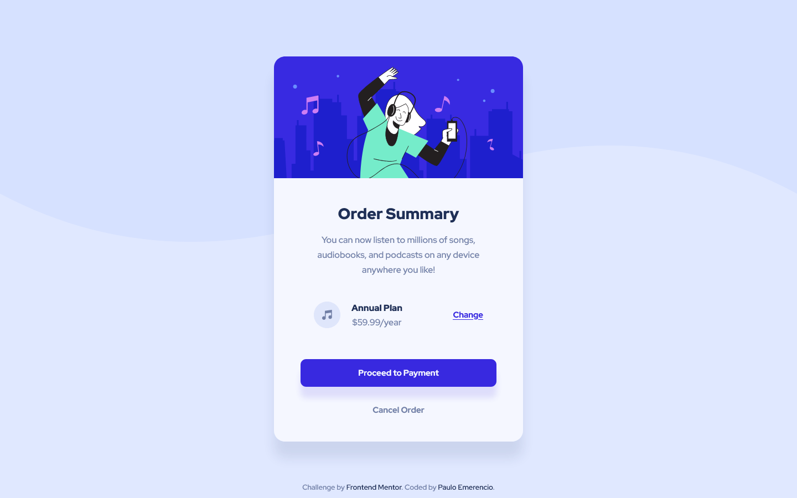

# Frontend Mentor - Order summary card solution

This is a solution to the [Order summary card challenge on Frontend Mentor](https://www.frontendmentor.io/challenges/order-summary-component-QlPmajDUj). Frontend Mentor challenges help you improve your coding skills by building realistic projects. 

## Table of contents

- [Overview](#overview)
  - [The challenge](#the-challenge)
  - [Screenshot](#screenshot)
  - [Links](#links)
- [My process](#my-process)
  - [Built with](#built-with)
  - [Continued development](#continued-development)
- [Author](#author)

## Overview

### The challenge

Users should be able to:

- See hover states for interactive elements

### Screenshot

### Links

- Solution URL: [Click to see my solution working!](https://paulo-emerencio.github.io/order-summary-component/)
- Live Site URL: [I don't have a site yet, so here is my youtube channel](https://www.youtube.com/c/RockcomLegendas)

## My process

### Built with

- Semantic HTML5 markup
- SCSS
- Flexbox
- Mobile-first workflow

### Continued development

After this one I'm going to delve into CSS Grid, so I can use it in the next challenge

## Author

- Frontend Mentor - [@Paulo-Emerencio](https://www.frontendmentor.io/profile/Paulo-Emerencio)
- Digital Innovation One - [@p_emerencio](https://web.digitalinnovation.one/users/p_emerencio?tab=achievements)
